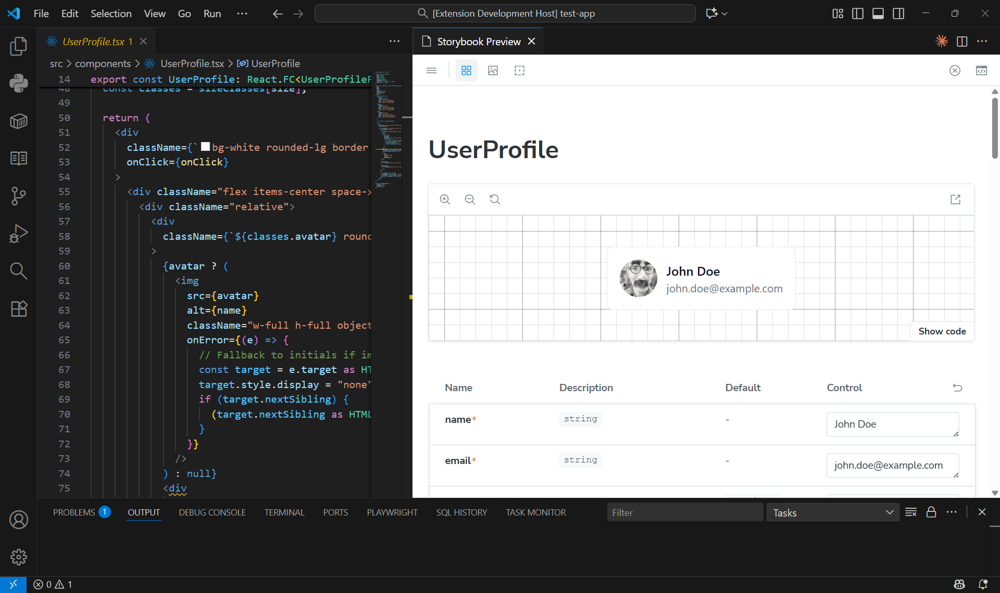

# Storybook View for VSCode

[](https://github.com/yourusername/storybook-view)
[](LICENSE)

> **Storybook integration for Visual Studio Code** - Preview your React components with all Storybook features directly in your editor.

## Features

- **📚 Full Storybook Integration** - Access all Storybook features, controls, and addons
- **👁️ One-Click Preview** - Click the eye icon on any component to view its stories
- **🔄 Hot Module Replacement** - Instant updates when you edit components
- **⚡ Smart Lifecycle** - Auto-starts when needed, stops after 5 minutes of inactivity
- **📖 Auto Documentation** - Generates component docs from TypeScript types
- **🎯 All Variations** - View all story variants in one unified interface
- **♿ Accessibility Testing** - Built-in a11y testing with Storybook addons


## Quick Start

### Prerequisites

This extension requires Storybook to be installed in your project. If you don't have it:

```bash
npx storybook@latest init
```

### Usage

1. Open a React component's `.stories.tsx` or `.stories.jsx` file
2. Click the **eye icon (👁️)** in the editor toolbar (appears only on `.stories` files)
3. Storybook preview opens with all your component's stories
4. Use Storybook's controls to interact with props

**Note:** The eye icon only appears on `.stories` files to ensure your component has properly configured Storybook stories.

That's it! The extension handles starting/stopping Storybook automatically.

## Creating Stories

Create a `.stories.tsx` file alongside your component:

```typescript
// Button.stories.tsx
import type { Meta, StoryObj } from "@storybook/react";
import { Button } from "./Button";

const meta = {
  title: "Components/Button",
  component: Button,
  parameters: {
    layout: "centered"
  },
  tags: ["autodocs"]
} satisfies Meta<typeof Button>;

export default meta;
type Story = StoryObj<typeof meta>;

export const Primary: Story = {
  args: {
    variant: "primary",
    children: "Click me"
  }
};

export const Secondary: Story = {
  args: {
    variant: "secondary",
    children: "Click me"
  }
};
```

## Commands

Access via Command Palette (`Ctrl+Shift+P` or `Cmd+Shift+P`):

| Command                                       | Description                             |
| --------------------------------------------- | --------------------------------------- |
| **Storybook View: Start Storybook Server**    | Manually start Storybook                |
| **Storybook View: Stop Storybook Server**     | Stop the Storybook server               |
| **Storybook View: Open Storybook in Browser** | Open full Storybook in external browser |

## Configuration

Configure in VS Code settings (`File > Preferences > Settings`):

```json
{
  "storybookview.port": 6006,
  "storybookview.autoRefresh": true
}
```

### Settings

| Setting                     | Type      | Default | Description                          |
| --------------------------- | --------- | ------- | ------------------------------------ |
| `storybookview.port`        | `number`  | `6006`  | Port for the Storybook server        |
| `storybookview.autoRefresh` | `boolean` | `true`  | Auto-refresh preview on file changes |

## How It Works

### Intelligent Lifecycle Management

1. **Auto-Start**: First preview takes ~10-20 seconds as Storybook starts
2. **Stays Running**: Subsequent previews are instant (no restart needed)
3. **Auto-Stop**: Stops after 5 minutes of inactivity to save resources
4. **Timer Reset**: Opening previews or editing files resets the inactivity timer

### What You Get

✅ **All Storybook Features**: Controls, actions, docs, a11y testing, and all addons
✅ **Industry Standard Tool**: Used by React, Material-UI, Ant Design, and thousands of teams
✅ **Auto-Generated Controls**: Type-safe prop controls from TypeScript interfaces
✅ **Professional Testing**: Test components with different prop combinations
✅ **Rich Documentation**: Auto-docs generated from your code
✅ **Team Collaboration**: Share Storybook URLs with designers and stakeholders

## Example Component

```typescript
// Button.tsx
interface ButtonProps {
  children: React.ReactNode;
  variant?: "primary" | "secondary" | "danger";
  size?: "small" | "medium" | "large";
  disabled?: boolean;
  onClick?: () => void;
}

export const Button: React.FC<ButtonProps> = ({
  children,
  variant = "primary",
  size = "medium",
  disabled = false,
  onClick
}) => {
  return (
    <button
      className={`btn btn-${variant} btn-${size}`}
      disabled={disabled}
      onClick={onClick}
    >
      {children}
    </button>
  );
};
```

**Storybook automatically generates:**

- Dropdown controls for `variant` and `size`
- Checkbox for `disabled`
- Text input for `children`
- Action logger for `onClick`
- Full TypeScript documentation

## Troubleshooting

### Storybook Won't Start

1. Ensure Storybook is installed in your project:

   ```bash
   npm install --save-dev @storybook/react-vite storybook
   ```

2. Verify Storybook works standalone:

   ```bash
   npm run storybook
   ```

3. Check that port 6006 is available

### Component Not Showing

1. Ensure you have a `.stories.tsx` file for your component
2. Verify the story file is in a location Storybook scans
3. Check Storybook configuration in `.storybook/main.ts`
4. Restart Storybook using Command Palette: "Storybook View: Stop Storybook Server" then preview again

### Preview Shows Wrong Content

1. Close the preview panel
2. Click the eye icon again on the correct component
3. Panel title should update to show the component name

## Screenshots

### Component Preview



## Why Storybook View?

### Better Than Custom Previews

✅ **Mature Ecosystem**: Leverage years of Storybook development and community
✅ **Rich Addons**: A11y, viewport testing, design integration, interactions, and more
✅ **Zero Setup**: Uses your existing Storybook configuration
✅ **Better Controls**: Auto-generated, type-safe prop controls
✅ **Built-in Testing**: Interaction testing and visual regression support

### Integrates with Your Workflow

- **No Context Switching**: Preview components without leaving VSCode
- **Fast Iteration**: Edit and see changes instantly with HMR
- **Team-Friendly**: Everyone uses the same Storybook setup
- **Production-Ready**: Same tool for development, documentation, and testing

## Requirements

- Visual Studio Code 1.74.0 or higher
- Node.js 16 or higher
- Storybook 7+ installed in your project

## Development & Contributing

### Building from Source

```bash
git clone https://github.com/yourusername/storybook-view.git
cd storybook-view
npm install
npm run compile
```

### Testing Locally

```bash
npm run dev  # Start TypeScript compilation in watch mode
```

Press `F5` in VSCode to launch the Extension Development Host.

### Package for Installation

```bash
npm run package
npm run install-extension
```

Contributions are welcome! Please open an issue or submit a pull request.

## License

[MIT](LICENSE) © Your Name

## Credits

Built with:

- [Storybook](https://storybook.js.org/) - Component development environment
- [Vite](https://vitejs.dev/) - Build tool and dev server
- [React](https://react.dev/) - UI library
- [TypeScript](https://www.typescriptlang.org/) - Type safety

---

**Enjoying Storybook View?** Star the repo on [GitHub](https://github.com/yourusername/storybook-view) and rate it on the [VSCode Marketplace](https://marketplace.visualstudio.com/)!
